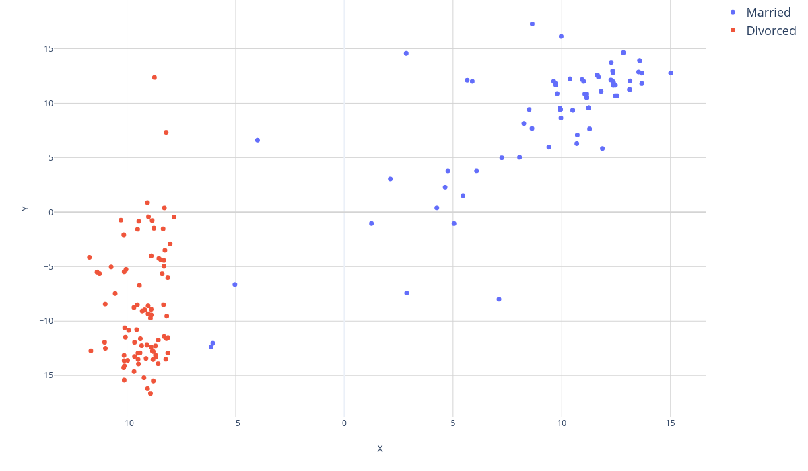
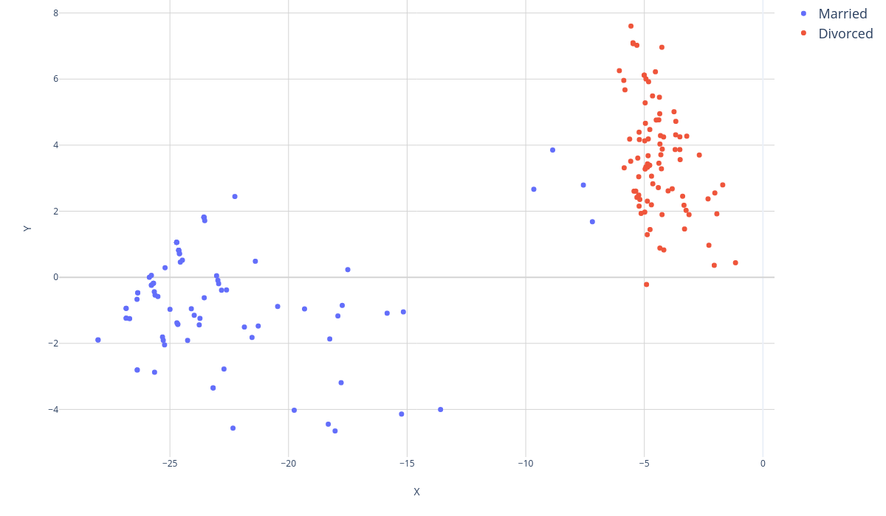
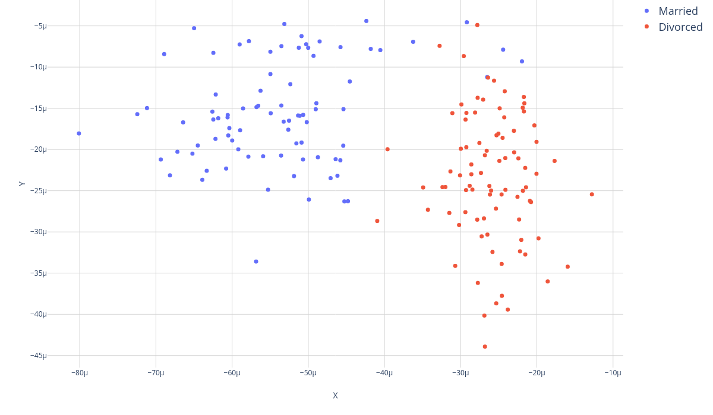

# Rubix - Divorce Predictor

Use the [K-nearest Neighbors](https://docs.rubixml.com/latest/classifiers/k-nearest-neighbors.html) algorithm built with the [Rubix ML](https://rubixml.com/) library to predict a couple's divorce likelyhood based on the answers to a 54 question survey about their partner designed in the study M. K. Yöntem et al. (2019), Divorce Prediction Using Correlation-based Feature Selection and Artificial Neural Networks. In this study more than 160 volunteer respondents were asked to share their honest feelings on the subjects following a 5-point scale, i.e., (0=Never, 1=Seldom, 2=Averagely, 3=Frequently, 4=Always).

All responses were collected in the human-annotated dataset, *dataset.csv*, that will be used to train the k-NN model.

## Installation

Clone the project locally and install the dependencies using [Composer](https://getcomposer.org/):

```sh
$ composer install
```

## Requirements

- [PHP](https://php.net) 7.2 or above

## Discussion

The authors were able to achieve an overall ~98% accuracy with a custom ANN. When it comes to using a more parsimonious model, though, the performance is still pretty high, crossing ~92% accuracy with a k-NN. Indeed despite the data distribution being high dimensional, some of the features were discovered to be redundant; in fact, most of them, with just 6 features carrying a discernable statistical relevance. The 6 maximally relevant and minimally redundant features are the following, ordered by significance:

</br>

|Feature|Question|Significance value|
|---|---|---|
|**Q2** |I know we can ignore our differences, even if things get hard sometimes.|**0.90**|
|**Q6** |We don’t have time at home as partners.|0.89|
|**Q11**|I think that one day, when I look back, I see that my spouse and I have been in harmony.|0.87|
|**Q18**| My spouse and I have similar ideas about how marriage should be.|0.84|
|**Q26**|I know my spouse's basic anxieties.|0.84|
|**Q40**|I can be humiliating when we have discussions.|0.83|

</br>

A further proof of the k-NN's good performance can be unravelled from the following plots of various 2D embeddings of the Divorce dataset. We can notice that, in these latent spaces, the clusters are usually pretty well defined and linearly separable, which is a good indication that the data in 54 dimensions is probably also fairly discernable. This means that not only a k-NN may be able to well characterize this problem, but also that it is likely for the k-NN to report a fully confident prediction (i.e, 1.0), especially with a low k setting.

In reading order from top to bottom:

### PCA embedding



### SVD embedding



### t-distributed SNE embedding


